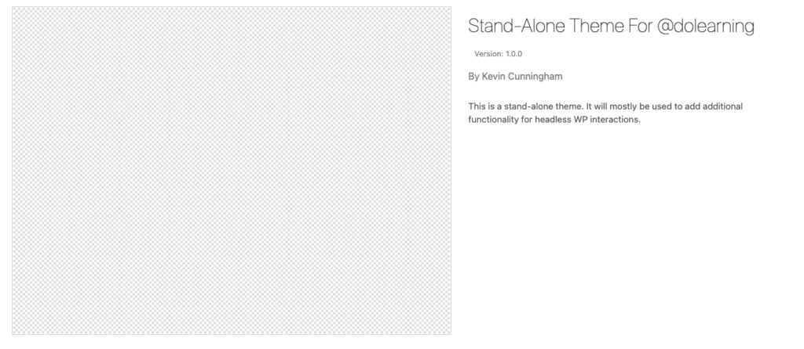
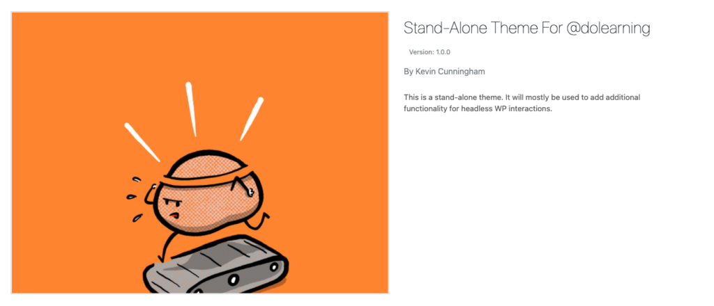

A WordPress theme is a group of files that work together to create the design of your site and control how your site behaves. These files can include template files, stylesheets, JavaScript files and other assets that contribute to the look and feel of your site.

There is a huge selection of themes available for WordPress. In the admin panel, you can go to Appearance->Themes->Add new and you'll be presented with over 8,000 themes ready to install.


There are also paid marketplaces where you can purchase themes and upload them manually to your WordPress instance.

If you are adding custom code to your WordPress instance, then managing that code in a theme is the best approach. This allows you to share your changes across sites and not be affected if the base theme you have edited is updated by it's developers.

The two approaches available to you are to create a child theme and to create your own theme.

## Child theme

A child theme is based on another them that you have already installed. Your child theme will use all of the files from the parent unless there is a replacement file. So, if you have a `functions.php` file in your child theme, this is the file that will be accessed rather than the one in the parent.

There is actually only one file required to create a child theme and that is the `style.css` file. We use a comment block at the start of this file to communicate our theme configuration to WordPress.

Create folder in your `/wp-content/themes` directory and, within that, create a `style.css` file.


Well done! You have now created a theme (almost). The minimum amount of information you can add to this file is the parent theme. I'm basing my child theme on the WordPress TwentyTwenty theme. Whichever you decide to use, make sure it is installed on your system.

```
/*
 Template:     twentytwenty
*/
```

WordPress will derive the theme name from the folder name (so child-theme in my case) and fall-back on defaults for all the other fields.


If you'd like you can add some more detail to the comment block in `style.css` and make the installation screen more informative. So this,

```
/*
 Theme Name:   Child Theme For @dolearning
 description: This is a child theme based on the twenty-twenty theme. It will mostly be used to add additional functionality for headless WP interactions.
 Author:       Kevin Cunningham
 Template:     twentytwenty
 Version:      1.0.0
*/
```

will result in this:


The large space for an image in this view can be filled by adding a screenshot.png or screenshot.jpg to the theme folder.


If you visit the front-end of your WordPress site now, you'll see it has lots of information but it is unstyled. This is pretty unsurprising because we have replaced the style.css file. Our child theme's version has priority. If you were to add the contents of the parent style.css to our file, below the comment, then all would be return to normal.

This method of superceding parent files allows for customisation to happen gradually overtime. Keeping your code in a child theme like this, also allows your code to be unaffected if the parent theme is updated.

## Stand-alone theme

The process to create your own stand-alone theme is very similar but requires two files to be created in the file system. We still have to create a `style.css` but now we also need a `index.php` file also.

If both of these files are created and left blank, then this is the theme installation screen we are presented with:


Adding a similar comment to the style.css file as before, such as:

```
/*
 Theme Name:   Stand-Alone Theme For @dolearning
 description: This is a stand-alone theme. It will mostly be used to add additional functionality for headless WP interactions.
 Author:       Kevin Cunningham
 Version:      1.0.0
*/
```

will result in this:



And finally, adding our screenshot gets us to a more enticing and useful installation screen:



## Conclusion

Now that we have our theme ready to go, we can gather whatever functionality we'd like - keeping it organised and safe. We can build of the brilliance of others by creating child themes or start with the bare bones with our stand-alone theme.

Most of my work with WordPress these days is in a headless context, so I tend to start from a bare theme and build up my functionality from there. WordPress is a great solution for a headless CMS - I've even written a book about it. If you'd like to know more, [head over here](https://learnetto.com/users/dolearning/courses/off-with-your-head).
